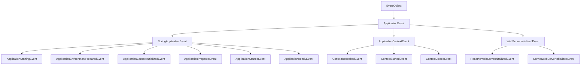

[TOC]


# springboot框架

## springboot基础

### SpringApplication

#### 初始化延迟

​		SpringApplication是可以延迟加载初始化实例的。通常情况下，beans在application启动时就被创建初始化了。延迟初始化可以是application启动速度更快。web服务启动时很多web相关的beans可以使用延迟初始化技术可以让其在http调用的时候才初始化。

​		然而延迟初始化的弊端许多问题只有在bean初始化时才被发现，这样造成运行时的异常，而且使用延迟初始化需要提前规划好堆内存的分配。

​       延迟配置如下

```properties
spring.main.lazy-initialization=true
```

  	另外，如果某些bean希望不被延迟加载可以在Bean上使用注解@Lazy(false)

#### 配置启动banner

​        springboot启动时的banner可以在通过在classpath下或者配置`srping.banner.location`指定路径增加banner.txt来修改显示内容。此外还可以通过配置`spring.banner.charset`来修改banner文件的编码。此外banner文件也可以时图片格式（jpg,jif,png等），默认放在classpath下，或者配置`spring.banner.image.location`属性。

​        banner文件可以获取的属性如下：

| 属性                                                         | 描述                                                         |
| ------------------------------------------------------------ | ------------------------------------------------------------ |
| ${application.version}                                       | 用来获取`MANIFEST.MF`文件中的版本号。例如：1.0               |
| ${application.formatted-version}                             | 格式化后的`${application.version}`版本信息。例如：v1.0       |
| ${spring-boot.version}                                       | Spring Boot的版本号。例如：2.2.2.RELEASE                     |
| ${spring-boot.formatted-version}                             | 格式化后的`${spring-boot.version}`版本信息。例如：v2.2.2.RELEASE |
| `${Ansi.NAME}` (or `${AnsiColor.NAME}`, `${AnsiBackground.NAME}`, `${AnsiStyle.NAME}`) | 设置控制台中输出内容的颜色                                   |
| ${application.title}                                         | 工程中MANIFEST.MF application的title                         |


#### 自定义SpringApplication

​		代码如下：

```java
public static void main(String []args){
    SpringApplication app = new SpringApplication(MySpringConfiguration.class);
    app.setBannerMode(Banner.Mode.OFF);
    app.run(args);
}
```

​		令：除了使用配置类还可以使用application.properties对进行配置。


#### 建造者模式启动Springboot

​		根据个人喜好，我们可以使用SpringApplication的建造者模式`SpringApplicationBuiler`，它可以链式调用方法并且可以使用parent和child方法创建新的包装，使用方式如下：

```java
new SpringApplicationBuilder().sources(Parent.class)
                              .child(Application.class)
                              .bannerMode(Banner.Moder.OFF)
                              .run(args);
```


#### Applocation Events and Listener配置

​		Spring Framework提供了很多的事件，例如ContextRefreshedEvent等

​        有些事件实际上是在ApplicationContext创建之前出发的，因此无法将其注册为@Bean。这时候可以使用`SpringApplication.addListeners（）`方法或者`SpringApplicationBuiler.listeners()`方法注册他们。

​		还可以通过将META-INF/spring.factories文件添加到项目中，并使用org.springframework.context.ApplicationListener键引用监听器，配置如下

```properties
org.springframework.context.ApplicationListener=com.example.project.MyListener
```

​		Application Event出发的顺序如下：

​         1.ApplicationStartingEvent

​         2.ApplicationEnvironmentPreparedEvent

​         3.ApplicationContextInitializedEvent

​         4.ApplicationPreparedEvent

​		 5.ApplicationStartedEvent

​		 6.ApplicationReadyEvent

​		 7.ApplicationFailedEvent

​		上述事件全部绑定到了SpringApplication。还有一些事件发生在ApplicationPreparedEvent之后ApplicationStartedEvent:

​		 1.ContextRefreshedEvent

​		 2.WebServerInitializedEvent

​		 3.ServletWebServerInitializedEvent

​		 4.ReactiveWebServerInitializedEvent


​		事件继承关系如下图所示，




#### Web环境配置

​		SpringApplication试图为你创建正确的ApplicationContext。这个用来判断WebApplicationType类型非常简单：

- 如果Spring MVC存在，那么使用`AnnotationConfigServletWebServerApplicationContext`
- 如果Spring MVC不存在，但是Spring WebFlux存在，那么使用`AnnotationConfigReactiveWebServerApplicationContext`
- 其他情况下，使用`AnnotationConfigApplicationContext`


#### 访问Application启动参数

​		如果需要访问通过`SpringApplication.run(....)`传入的application参数，可以注入`org.springframework.boot.ApplicationArguments` bean。`ApplicationArguments`接口既提供了原始类型`String[]`的参数，同时也提供了`opntion`与`non-option`参数，示例如下

```java
import org.springframework.boot.*;
import org.springframework.beans.factory.annotation.*;
import org.springframework.stereotype.*;

@Component
public class MyBean {

    @Autowired
    public MyBean(ApplicationArguments args) {
        boolean debug = args.containsOption("debug");
        List<String> files = args.getNonOptionArgs();
        // if run with "--debug logfile.txt" debug=true, files=["logfile.txt"]
    }
}
```


#### 启动runner（ApplicationRunner与CommandLineRunner）

​		如果`SpringApplication`启动后需要运行一些特定的代码，则可以实现`ApplicationRunner`或`CommandLineRunner`接口。这两个接口以相同的方式工作，并提供一个单一的`run`方法，该方法在`SpringApplication.run(…)`完成之前就被调用。


​		`CommandLineRunner`接口提供访问的应用程序的参数作为一个简单的字符串数组，而`ApplicationRunner`使用前面讨论的`ApplicationArguments`接口更容易。以下示例显示了一个`CommandLineRunner`with `run`方法：

```java
import org.springframework.boot.*;
import org.springframework.stereotype.*;

@Component
public class MyBean implements CommandLineRunner {

    public void run(String... args) {
        // Do something...
    }

}
```

​		如果几个`CommandLineRunner`或`ApplicationRunner`bean中定义必须在一个特定的顺序被调用，您还可以实现`org.springframework.core.Ordered`接口或使用`org.springframework.core.annotation.Order`注解。


#### 服务退出

​		每个`SpringApplication`向JVM注册了一个关闭的钩子(hook)来保证`ApplicationContext`在服务退出的时候更加优雅的关闭。可以使用所有标准的spring生命周期回调（例如：DisposableBean接口或者@ProDestory注解）。

​		此外，如果bean希望在`SpringApplication.exit()`被调用的时候返回特定的退出代码，则可以实现接口`org.springframework.boot.ExitCodeGenerator`。然后可以将此退出代码传递给`System.exit()`，以将其作为状态代码返回，如以下示例所示：

```java
@SpringBootApplication
public class ExitCodeApplication {

    @Bean
    public ExitCodeGenerator exitCodeGenerator() {
        return () -> 42;
    }

    public static void main(String[] args) {
     System.exit(SpringApplication.exit(SpringApplication.run(ExitCodeApplication.class, args)));
    }

}
```

​		同时，`ExitCodeGenerator`接口可以通过异常来实现。当遇到这样的异常时，Spring Boot返回由实现了`getExitCode()`方法提供的退出代码。

#### Admin功能特性

​		通过指定`spring.application.admin.enabled`属性，可以为应用程序启用与管理员相关的功能。这将`SpringApplicationAdminMXBean`在平台上公开`MBeanServer`。您可以使用此功能来远程管理Spring Boot应用程序。此功能对于任何服务包装器实现也可能很有用。


### 属性配置

​		Spring Boot使您可以外部化配置，以便可以在不同环境中使用相同的应用程序代码。您可以使用属性文件，YAML文件，环境变量和命令行参数来外部化配置。属性值可以通过直接注射到你的bean `@Value`注解，通过Spring的访问`Environment`抽象，或者通过`@ConfigurationProperties`被绑定到结构化对象。

Spring Boot使用一个非常特殊的`PropertySource`顺序，该顺序旨在允许合理地覆盖值。按以下顺序考虑属性：

1. 当devtools处于激活状态时`$HOME/.config/spring-boot`文件夹中的Devtools全局设置属性。
2. 测试中的使用了`@TestPropertySource`注解。
3. `properties`测试中的属性。可用于`@SpringBootTest`注解在测试应用程序的特定部分。
4. 命令行参数。
5. 来自的属性`SPRING_APPLICATION_JSON`（嵌入在环境变量或系统属性中的嵌入式JSON）。
6. `ServletConfig` 初始化参数。
7. `ServletContext` 初始化参数。
8. JNDI属性`java:comp/env`。
9. Java系统属性（`System.getProperties()`）。
10. 操作系统环境变量。
11. `RandomValuePropertySource`，只拥有随机属性`random.*`的文件。
12. 打包的jar（`application-{profile}.properties`和YAML变体）之外的Profile-specific application properties。
13. 打包在jar中的Profile-specific application properties（`application-{profile}.properties`和YAML变体）。
14. 打包的jar（`application.properties`和YAML变体）之外的Application properties。
15. 打包在jar中的Application properties（`application.properties`和YAML变体）。
16. `@Configuration`类内`@PropertySource`的注解。请注意，`Environment`在刷新应用程序上下文之前，不会将此类属性源添加到中。现在配置某些属性（如`logging.*`和`spring.main.*`在刷新开始之前先读取）为时已晚。
17. 默认属性（通过设置指定`SpringApplication.setDefaultProperties`）。

为了提供一个具体的示例，假设您开发了一个`@Component`使用`name`属性的，如以下示例所示：

```java
import org.springframework.stereotype.*;
import org.springframework.beans.factory.annotation.*;

@Component
public class MyBean {

    @Value("${name}")
    private String name;

    // ...

}
```

在您的应用程序类路径内（例如，在jar内），您可以使用一个`application.properties`文件，该文件为提供合理的默认属性值`name`。在新环境中运行时，`application.properties`可以在jar外部提供一个文件，该文件将覆盖`name`。对于一次性测试，可以使用特定的命令行开关（例如，`java -jar app.jar --name="Spring"`）启动。


`SPRING_APPLICATION_JSON`属性可以在命令行中提供环境变量。例如，您可以在UN * X shell中使用以下行：

```
$ SPRING_APPLICATION_JSON ='{“ acme”：{“ name”：“ test”}}}'java -jar myapp.jar
```

在前面的示例中，您在Spring中`Environment`声明了`acme.name=test`。您还可以像`spring.application.json`在System属性中一样提供JSON ，如以下示例所示：

```
$ java -Dspring.application.json ='{“ name”：“ test”}'-jar myapp.jar
```

您还可以使用命令行参数来提供JSON，如以下示例所示：

```
$ java -jar myapp.jar --spring.application.json ='{“ name”：“ test”}'
```

您还可以将JSON作为JNDI变量提供，如下所示：`java:comp/env/spring.application.json`。


#### 配置随机数值属性

​		`RandomValuePropertySource`是用于注射的随机值（例如，进入机密或试验例）是有用的。它可以产生integer，longs，uuid或strings，如以下示例所示：

```properties
my.secret=${random.value}
my.number=${random.int}
my.bignumber=${random.long}
my.uuid=${random.uuid}
my.number.less.than.ten=${random.int(10)}
my.number.in.range=${random.int[1024,65536]}
```

​		该`random.int*`语法是`OPEN value (,max) CLOSE`其中的`OPEN,CLOSE`任何字符和`value,max`是整数。如果`max`提供，`value`则为最小值，`max`为最大值（不包括）。


#### 获取命令行属性

​		默认情况下，SpringApplication把命令行传入的任何参数（参数传入方式以 --开头，如--server-port=9000）都会转化成一个属性并且将其加入的Spring的`Environment`。正如之前提到的，命令行参数属性始终优先于其他属性源。

​		如果您不想将命令行属性添加到中`Environment`，则可以使用`SpringApplication.setAddCommandLineProperties(false)`禁用它们。


#### Application Property配置文件

​		SpringApplication从以下几个位置加载application.properties,并将其添加到Spring的`Evironment`:		

1. /config目录以及子目录下

2. 当前目录下

3. classpath下的/config目录下

4. classpath根目录下

   配置文件的属性优先级顺序如上所示，上面配置的属性会覆盖下面配置的属性。


​		如果你不喜欢使用application.properties作为配置文件的名称，你可以通过配置`spring.config.name`属性来指定配置文件名，同时可以使用`spring.config.location`属性来指定配置文件的路径。配置示例如下：

```bash
 java -jar myproject.jar --spring.config.name=myproject
 
 java -jar myproject.jar --spring.config.location=classpath:/default.properties,classpath:/override.properties
```


​		如果`spring.config.location` 包含的是文件目录，那么需要以`/`结尾（在运行时结尾将添加上`spring.config.name`所指定的文件名称）。`spring.config.location`指定的文件，不支持特定于配置文件的变体，并且被任何特定于配置文件的属性覆盖。

​		指定配置文件的路径加载顺序与优先级顺序是相反的，默认顺序如下：

1. classpath:/
2. classpath:/config/
3. file:./
4. file:./config/


​		普通的配置文件路径同样可以使用`spring.config.localtion`指定配置路径，他们的加载顺序是

1. file:./custom-config/
2. classpath:custom-config/

​		或者，当普通的配置文件路径使用`spring.config.additional-location`进行配置。普通文件的加载顺序如下：

1. file:./custom-config/
2. classpath:custom-config/
3. file:./config/
4. file:./
5. classpath:/config/
6. classpath:/


#### Profile-specific属性（特定配置属性）

​		除了使用application.properties配置属性外，我们还可以使用以下命名约定来定义特定于配置文件的属性：`application-{profile}.properties`。在`Environment`具有一组默认的配置文件（默认`[default]`）如果没有活动的简档设置中使用。换句话说，如果未显式激活任何概要文件，那么将从`application-default.properties`中加载属性。

​		特定于配置文件的属性加载位置与标准的`application.properties`的路径是相同的，特定的配置文件的文件始终会覆盖非特定文件，无论特定于配置文件的文件是在打包jar的内部还是外部。

​		如果指定了多个配置文件，则采用后赢策略。例如，由`spring.profiles.active`属性指定的配置文件会在通过`SpringApplication`API 配置的配置文件之后添加，因此具有优先权。


#### 属性占位符

​		`application.properties`中声明的属性使用时会先被存在的`Environment`过滤，因此您可以参考以前定义的值（例如，从“系统”属性中）。

```properties
app.name=MyApp
app.description=${app.name} is a Spring Boot application
```


#### 加密属性

​		Spring Boot没有提供任何内置的属性加密方式，但是在spring的`Environment`它提供了修改spring包含值的勾子。`EnvironmentPostProcessor`接口允许你在application启动前操作`Environment`。

​		

#### 使用YAML代替properties

1. Spring Framework提供了两个便利的class用来加载YAML文件。`YamlPropertiesFactoryBean`加载YAML并封装成properties，`YamlMapFactoryBean`加载YAML并封装成Map。

2. `YamlPropertySourceLoader`类将YAML作为`PropertySource`暴露在Spring的`Environment`。这样可以方便我们使用`@Value`注解获取YAML配置的属性。

3. 我们可以声明多个YAML配置文件在一个单独的文件中，通过使用`spring.profiles`指定使用的文档，使用示例如下：

   ```yaml
   server:
       address: 192.168.1.100
   ---
   spring:
       profiles: development
   server:
       address: 127.0.0.1
   ---
   spring:
       profiles: production & eu-central
   server:
       address: 192.168.1.120
   ```

   注：profiles可以使用一些逻辑表达式

4. YAML缺点：a.YAML文件无法使用@PropertySource注解加载属性。

   ​				 	 b.在同一个YAML文件中配置进行多环境配置会导致意外异常（配置容易发生混乱）

   


#### 类型安全的配置属性

​		使用`@Value("${property}")`注释注入配置属性有时会很麻烦，尤其是当您使用多个属性或数据本质上是分层的时。Spring Boot提供了一种使用属性的替代方法，该属性使强类型的Bean可以管理和验证应用程序的配置。

##### JavaBean属性绑定

​		可以绑定一个声明标准JavaBean类型的属性bean，如以下示例所示：

```java
package com.example;

import java.net.InetAddress;
import java.util.ArrayList;
import java.util.Collections;
import java.util.List;

import org.springframework.boot.context.properties.ConfigurationProperties;

@ConfigurationProperties("acme")
public class AcmeProperties {

    private boolean enabled;

    private InetAddress remoteAddress;

    private final Security security = new Security();

    public boolean isEnabled() { ... }

    public void setEnabled(boolean enabled) { ... }

    public InetAddress getRemoteAddress() { ... }

    public void setRemoteAddress(InetAddress remoteAddress) { ... }

    public Security getSecurity() { ... }

    public static class Security {

        private String username;

        private String password;

        private List<String> roles = new ArrayList<>(Collections.singleton("USER"));

        public String getUsername() { ... }

        public void setUsername(String username) { ... }

        public String getPassword() { ... }

        public void setPassword(String password) { ... }

        public List<String> getRoles() { ... }

        public void setRoles(List<String> roles) { ... }

    }
}
```

前面的POJO定义了以下属性：

- `acme.enabled`，`false`默认值为。
- `acme.remote-address`，将`String`类型强制转换为InetAddress类型。
- `acme.security.username`，其嵌套的“security”对象的名称由属性的名称确定。特别是，返回类型根本不使用，可能已经使用过`SecurityProperties`。
- `acme.security.password`。
- `acme.security.roles`，`String`其默认值为`USER`。


##### 构造函数绑定

```java
package com.example;

import java.net.InetAddress;
import java.util.List;

import org.springframework.boot.context.properties.ConfigurationProperties;
import org.springframework.boot.context.properties.ConstructorBinding;
import org.springframework.boot.context.properties.DefaultValue;

@ConstructorBinding
@ConfigurationProperties("acme")
public class AcmeProperties {

    private final boolean enabled;

    private final InetAddress remoteAddress;

    private final Security security;

    public AcmeProperties(boolean enabled, InetAddress remoteAddress, Security security){
        this.enabled = enabled;
        this.remoteAddress = remoteAddress;
        this.security = security;
    }

    public boolean isEnabled() { ... }

    public InetAddress getRemoteAddress() { ... }

    public Security getSecurity() { ... }

    public static class Security {

        private final String username;

        private final String password;

        private final List<String> roles;

        public Security(String username, String password,
                @DefaultValue("USER") List<String> roles) {
            this.username = username;
            this.password = password;
            this.roles = roles;
        }

        public String getUsername() { ... }

        public String getPassword() { ... }

        public List<String> getRoles() { ... }

    }

}
```


​		在此设置中，`@ConstructorBinding`注解用于指示应使用构造函数绑定。这意味着绑定器将期望找到带有您希望绑定的参数的构造函数。

​		`@ConstructorBinding`所在类的嵌套成员（例如上面的示例`Security`）也将通过其构造函数进行绑定。

可以使用`@DefaultValue`指定默认值，并且将应用相同的转换服务将`String`值强制为缺少属性的目标类型。


##### 启用@ConfigurationProperties注解

​		Spring Boot提供了使用`@ConfigurationProperties`注解将属性注入Bean的基础架构。您可以逐类启用配置属性，也可以启用与组件扫描类似的方式进行配置属性扫描。

​		有时，带`@ConfigurationProperties`注解的类可能不适合扫描，例如，如果您正在开发自己的自动配置或想要有条件地启用它们。在这些情况下，请使用`@EnableConfigurationProperties`注解指定要处理的类型列表。可以在任何`@Configuration`类上完成此操作，如以下示例所示：

```java
@Configuration(proxyBeanMethods = false)
@EnableConfigurationProperties(AcmeProperties.class)
public class MyConfiguration {
}
```

​		要使用属性扫描组件，请将`@ConfigurationPropertiesScan`注解添加到您的应用程序。通常，它将添加到带有注释的主应用程序类中，`@SpringBootApplication`但可以将其添加到任何`@Configuration`类中。默认情况下，将从声明注解的类的包中进行扫描。如果要定义要扫描的特定程序包，可以按照以下示例所示进行操作：

```java
@SpringBootApplication
@ConfigurationPropertiesScan({ "com.example.app", "org.acme.another" })
public class MyApplication {
}
```

​		我们建议`@ConfigurationProperties`仅处理环境，尤其不要从上下文中注入其他bean。对于特殊情况，可以使用setter注入或`*Aware`框架提供的任何接口（例如，`EnvironmentAware`如果需要访问`Environment`）。如果您仍想使用构造函数注入其他bean，则属性配置的bean必须使用`@Component`注解，并基于JavaBean的属性绑定。

##### 使用@ConfigurationProperties注解

​		这种配置样式特别适用于`SpringApplication`外部YAML配置，如以下示例所示：

```yaml
# application.yml

acme:
    remote-address: 192.168.1.1
    security:
        username: admin
        roles:
          - USER
          - ADMIN

# additional configuration as required
```

​		要使用`@ConfigurationProperties`bean，可以像使用其他任何bean一样注入它们，如以下示例所示：

```java
@Service
public class MyService {

    private final AcmeProperties properties;

    @Autowired
    public MyService(AcmeProperties properties) {
        this.properties = properties;
    }

    //...

    @PostConstruct
    public void openConnection() {
        Server server = new Server(this.properties.getRemoteAddress());
        // ...
    }

}
```

##### 第三方配置

​		除了`@ConfigurationProperties`用于注解类之外，您还可以在公共的`@Bean`方法上使用它。当您要将属性绑定到控件之外的第三方组件时，这样做特别有用。

要通过`Environment`属性配置bean ，请添加`@ConfigurationProperties`到其bean注册中，如以下示例所示：

```java
@ConfigurationProperties(prefix = "another")
@Bean
public AnotherComponent anotherComponent() {
    ...
}
```

​		用`another`前缀定义的任何JavaBean属性都`AnotherComponent`以类似于前面`AcmeProperties`示例的方式映射到该bean 。

##### 宽松的绑定规则

​		Spring Boot使用一些宽松的规则将`Environment`属性绑定到`@ConfigurationProperties`Bean，因此`Environment`属性名称和Bean属性名称之间不需要完全匹配。有用的常见示例包括破折号分隔的环境属性（例如，`context-path`绑定到`contextPath`）和大写的环境属性（例如，`PORT`绑定到`port`）。

​		例如：

```java
@ConfigurationProperties(prefix="acme.my-project.person")
public class OwnerProperties {

    private String firstName;

    public String getFirstName() {
        return this.firstName;
    }

    public void setFirstName(String firstName) {
        this.firstName = firstName;
    }

}
```

使用前面的代码，以下属性名称：


**Table 2. 宽松的绑定规则**

| Property                            | Note                                                         |
| :---------------------------------- | :----------------------------------------------------------- |
| `acme.my-project.person.first-name` | 中横线表示法，建议在`.properties`和`.yml`文件中使用。        |
| `acme.myProject.person.firstName`   | 标准驼峰式语法。                                             |
| `acme.my_project.person.first_name` | 下划线表示法，是在`.properties`和`.yml`文件中使用的另一种格式。 |
| `ACME_MYPROJECT_PERSON_FIRSTNAME`   | 大写格式，使用系统环境变量时建议使用。                       |


**Table 3. 每种属性源文件宽松规则列表**

| Property Source       | Simple                                                 | List                                                         |
| :-------------------- | :----------------------------------------------------- | :----------------------------------------------------------- |
| Properties Files      | 驼峰式，中横线或下划线表示法                           | 使用`[ ]`或以逗号分隔的值的标准列表语法                      |
| YAML Files            | 驼峰式，中横线或下划线表示法                           | 标准YAML列表语法或逗号分隔的值                               |
| Environment Variables | 以下划线作为定界符的大写格式。 `_`不应在属性名称中使用 | 下划线括起来的数值，例如 `MY_ACME_1_OTHER = my.acme[1].other` |
| System properties     | 驼峰式，中横线或下划线表示法                           | 使用`[ ]`或以逗号分隔的值的标准列表语法                      |

​		

​		当绑定`Map`属性时，如果`key`包含除小写字母数字字符或`-`之外的任何内容，则需要使用方括号表示法，以便保留原始值。如果键没有被包围`[]`，则所有非字母数字或`-`的字符将被删除。例如，考虑将以下属性绑定到`Map`：

```yaml
acme:
  map:
    "[/key1]": value1
    "[/key2]": value2
    /key3: value3
```

​		上面的属性将以`/key1`，`/key2`并`key3`作为key绑定到Map中。


##### 合并复杂类型

​		如果在多个位置配置了`List`，则通过替换整个`List`来进行覆盖。

​		例如，假定默认情况下`MyPojo`具有`name`和`description`属性的对象`null`。以下示例中`AcmeProperties`类包含`MyPojo`类示例的一个列表（`List`）：

```java
@ConfigurationProperties("acme")
public class AcmeProperties {

    private final List<MyPojo> list = new ArrayList<>();

    public List<MyPojo> getList() {
        return this.list;
    }

}
```

考虑以下配置：

```yaml
acme:
  list:
    - name: my name
      description: my description
---
spring:
  profiles: dev
acme:
  list:
    - name: my another name
```

​		如果`dev`配置文件未启用，则`AcmeProperties.list`包含一个`MyPojo`条目，如先前所定义。如果`dev`配置文件被启用，则`list` *仍然*仅包含一个条目（name为`my another name`，description为`null`）。此配置*不会*将第二个`MyPojo`实例添加到列表中，并且不会合并项目。

​		`List`在多个配置文件中配置时，将使用优先级最高的一个（并且只有该优先级）。考虑以下示例：

```yaml
acme:
  list:
    - name: my name
      description: my description
    - name: another name
      description: another description
---
spring:
  profiles: dev
acme:
  list:
    - name: my another name
```

​		在前面的示例中，如果`dev`配置文件处于启用状态，则`AcmeProperties.list`包含*一个* `MyPojo`实体类（name为`my another name`，description为`null`）。对于YAML，可以使用逗号分隔的列表和YAML列表来完全覆盖列表的内容。

​		对于`Map`属性，可以绑定从多个来源的属性值。但是，对于多个源中的同一属性，将使用优先级最高的属性。示例如下：

```java
@ConfigurationProperties("acme")
public class AcmeProperties {

    private final Map<String, MyPojo> map = new HashMap<>();

    public Map<String, MyPojo> getMap() {
        return this.map;
    }

}
```

​		考虑以下配置：

```yaml
acme:
  map:
    key1:
      name: my name 1
      description: my description 1
---
spring:
  profiles: dev
acme:
  map:
    key1:
      name: dev name 1
    key2:
      name: dev name 2
      description: dev description 2
```

​		如果`dev`配置文件未处于活动状态，则`AcmeProperties.map`包含一个带有键`key1`的实体类（name为`my name 1`，description为`my description 1`）。`dev`但是，如果启用了配置文件，则`map`包含两个带有键的条目`key1`（name为`dev name 1`和description为`my description 1`）和一个带有键为`key2`的实体类（name为`dev name 2`和description为`dev description 2`）。


##### 属性转换

​		当Spring Boot绑定属性到`@ConfigurationProperties`注解的bean 时，它试图将外部应用程序属性强制为合适的属性的类型。如果您需要自定义类型转换，则可以提供一个`ConversionService`Bean（名称被定义为 `conversionService`的Bean）或一个定制属性编辑器（通过一个`CustomEditorConfigurer`Bean）或定制`Converters`（使用 `@ConfigurationPropertiesBinding`注解定义的bean）。


**转换时间**

Spring Boot支持时间格式转换。如果时间格式为`java.time.Duration`，则属性可使用以下格式：

- 常规`long`表示形式（使用毫秒作为默认单位，除非使用`@DurationUnit`注解指定了时间单位）
- 标准的ISO-8601格式（使用`java.time.Duration`）
- 值和单位组合的格式（例如，`10s`表示10秒）

考虑以下示例：

```java
@ConfigurationProperties("app.system")
public class AppSystemProperties {

    @DurationUnit(ChronoUnit.SECONDS)
    private Duration sessionTimeout = Duration.ofSeconds(30);

    private Duration readTimeout = Duration.ofMillis(1000);

    public Duration getSessionTimeout() {
        return this.sessionTimeout;
    }

    public void setSessionTimeout(Duration sessionTimeout) {
        this.sessionTimeout = sessionTimeout;
    }

    public Duration getReadTimeout() {
        return this.readTimeout;
    }

    public void setReadTimeout(Duration readTimeout) {
        this.readTimeout = readTimeout;
    }

}
```

要指定30秒的会话超时`30`，`PT30S`和`30s`都等效。500毫秒的读取超时可以以任何形式如下指定：`500`，`PT0.5S`和`500ms`。

您也可以使用任何受支持的单位。这些是：

- `ns` 十亿分之一秒，纳秒
- `us` 微秒
- `ms` 毫秒
- `s` 秒钟
- `m` 分钟
- `h` 小时
- `d` 天

默认单位是毫秒，可以使用上面的示例中所示的`@DurationUnit`注解进行覆盖。


**转换数据大小**

Spring Framework的`DataSize`值类型表示字节大小。如果设置`DataSize`类型的属性，则可以使用以下格式：

- 常规`long`表示形式（除非`@DataSizeUnit`已指定，否则使用字节作为默认单位）
- 值和单位耦合的更具可读性的格式（例如，`10MB`意味着10兆字节）

考虑以下示例：

```java
@ConfigurationProperties("app.io")
public class AppIoProperties {

    @DataSizeUnit(DataUnit.MEGABYTES)
    private DataSize bufferSize = DataSize.ofMegabytes(2);

    private DataSize sizeThreshold = DataSize.ofBytes(512);

    public DataSize getBufferSize() {
        return this.bufferSize;
    }

    public void setBufferSize(DataSize bufferSize) {
        this.bufferSize = bufferSize;
    }

    public DataSize getSizeThreshold() {
        return this.sizeThreshold;
    }

    public void setSizeThreshold(DataSize sizeThreshold) {
        this.sizeThreshold = sizeThreshold;
    }

}
```

指定10 MB的缓冲区大小，`10`与`10MB`等效。可以将256个字节的大小阈值指定为`256`或`256B`。

您也可以使用任何受支持的单位。这些是：

- `B` 字节
- `KB` 千字节
- `MB` 兆字节
- `GB` 千兆字节
- `TB` 太字节

默认单位是字节，可以使用`@DataSizeUnit`上面的示例中所示的方法覆盖它。


##### @ConfigurationProperties属性校验

​		`ConfigurationProperties`每当使用Spring的`@Validated`注释对其进行注释时，Spring Boot就会尝试验证类。您可以`javax.validation`直接在配置类上使用JSR-303 约束注释。为此，请确保在classpath下有兼容的JSR-303实现，然后将约束注解添加到字段中，如以下示例所示：

```java
@ConfigurationProperties(prefix="acme")
@Validated
public class AcmeProperties {

    @NotNull
    private InetAddress remoteAddress;

    // ... getters and setters

}
```

​		为了确保始终为嵌套属性触发验证，即使未找到任何属性，相关字段也必须使用注解`@Valid`。下面的示例基于前面的`AcmeProperties`示例：

```java
@ConfigurationProperties(prefix="acme")
@Validated
public class AcmeProperties {

    @NotNull
    private InetAddress remoteAddress;

    @Valid
    private final Security security = new Security();

    // ... getters and setters

    public static class Security {

        @NotEmpty
        public String username;

        // ... getters and setters

    }

}
```

​		您还可以通过创建名为`configurationPropertiesValidator`的bean定义来添加自定义Spring `Validator` 。该`@Bean`方法应声明为`static`类型。配置属性验证器是在应用程序生命周期的早期创建的，并且将`@Bean`方法声明为static可以使Bean得以创建而不必实例化`@Configuration`该类。这样做避免了由早期实例化引起的任何问题。


##### @ConfigurationProperties与@Value

`@Value`注解是核心容器的功能，它不提供像类型安全配置属性等类似的功能。下表总结了`@ConfigurationProperties`和`@Value`支持的功能：

| 特征        | `@ConfigurationProperties` | `@Value` |
| :---------- | :------------------------- | :------- |
| 宽松的绑定  | Yes                        | No       |
| 元数据支持  | Yes                        | No       |
| `SpEL` 评价 | No                         | Yes      |

​		如果您为自己的组件定义了一组配置键，我们建议您将它们组合在以`@ConfigurationProperties`标记的POJO中。您还应该意识到，由于`@Value`不支持宽松的绑定，因此如果您需要通过使用环境变量来提供值，则不是一个很好的选择。

​		最后，尽管您可以在其中写入`SpEL`表达式`@Value`，但不会从应用程序属性文件中处理此类表达式。


### Profiles

​		Spring Profiles提供了一种隔离应用程序配置部分并使之仅在某些环境中可用的方法。`@Component`，`@Configuration`或`@ConfigurationProperties`注解可以与`@Profile`注解一起使用进行特定环境的限制，示例如下：

```java
@Configuration(proxyBeanMethods = false)
@Profile("production")
public class ProductionConfiguration {

    // ...

}
```


​		您可以使用`spring.profiles.active` 属性配置在`Environment`中哪些配置文件被启用。您可以通过本章前面介绍的任何方式指定属性。例如，您可以将其包括在您的中`application.properties`，如以下示例所示：

```properties
spring.profiles.active=dev,hsqldb
```

​		您也可以在命令行中指定它：`--spring.profiles.active=dev,hsqldb`。


#### 添加活动配置文件

​		`spring.profiles.active`属性与其他属性遵循相同的排序规则：最先使用`PropertySource`最高优先级属性。这意味着您可以在`application.properties`中指定启用的配置文件，然后使用命令行开关**替换**它们。

​		有时，将特定于配置文件的属性**添加**到活动配置文件而不是替换它们更有效。`spring.profiles.include`属性可用于无条件添加启用配置文件。`SpringApplication`入口点提供了Java API来设计附加的配置（即，是对那些被激活的顶级`spring.profiles.active`属性）。参见SpringApplication的`setAdditionalProfiles()`方法。

​		例如，当应用程序运行时配置如下属性`--spring.profiles.active=prod`，`proddb`和`prodmq`配置文件也会被激活：

```yaml
---
my.property: fromyamlfile
---
spring.profiles: prod
spring.profiles.include:
  - proddb
  - prodmq
```

#### 以编程方式设置配置文件

​		您可以在应用程序运行之前使用`SpringApplication.setAdditionalProfiles(…)`通过编码的方式设置激活的配置文件。也可以通过使用Spring的`ConfigurableEnvironment`接口来激活配置文件。

#### 特定于配置文件的配置文件

​		`application.properties`（或`application.yml`）和通过`@ConfigurationProperties`注解的文件中的特殊配置都被视为文件并已加载。


### 日志配置


#### 日志格式

​		日志默认的输出项如下：

- Date and Time（日期和时间）：毫秒精度，易于排序。

- Log Level（日志级别）：`ERROR`，`WARN`，`INFO`，`DEBUG`，或`TRACE`。
- Process ID （进程ID）。
- `---`（分离器）：来区分实际日志消息的开始。
- Thread name（线程名称）：用方括号括起来（对于控制台输出可能会被截断）。
- Logger name（记录器名称）：这通常是源类名称（通常缩写）。
- The log message（日志消息）。


[^注 ]: LogBack日志级别没有`FATAL`，而是使用`ERROR`


#### 日志输出

​		默认情况下日志可以输出`ERROR`,`WARN`,`INFO`级别的消息会被输出。同时可以通过增加启动参数`--dubug`或者在`application.properties`中添加`debug=true`在来启用日志的“debug”模式。示例如下：

```shell
java -jar myapp.jar --debug
```

​		日志的trace模式配置与debug配置相同。


​		不同的日志在终端显示不同的颜色可以通过设置属性`spring.output.ansi.enabled`来配置。日志具体的颜色配置可以使用`%clr`进行设置，示例如下：

```
%clr(%d{yyyy-MM-dd HH:mm:ss:SSS}){yello}
```


目前支持以下颜色：

- `blue`
- `cyan`
- `faint`
- `green`
- `magenta`
- `red`
- `yellow`


​		下面列表是默认情况下不同日志级别显示的日志颜色：

| Level   | Color  |
| :------ | :----- |
| `FATAL` | Red    |
| `ERROR` | Red    |
| `WARN`  | Yellow |
| `INFO`  | Green  |
| `DEBUG` | Green  |
| `TRACE` | Green  |

​		

#### 日志输出文件

​		SpringBoot默认输出为console并没有写入日志文件。需要通过在`application.peroperties`配置属性`logging.file.name`或者`logging.file.path`来指定log的配置文件。


**Table 4.日志属性配置**

| `logging.file.name` | `logging.file.path` | Example    | Description                                                  |
| :------------------ | :------------------ | :--------- | :----------------------------------------------------------- |
| *(none)*            | *(none)*            |            | Console only logging.                                        |
| Specific file       | *(none)*            | `my.log`   | Writes to the specified log file. Names can be an exact location or relative to the current directory. |
| *(none)*            | Specific directory  | `/var/log` | Writes `spring.log` to the specified directory. Names can be an exact location or relative to the current directory. |


​		（1）日志文件默认大小为10M，可以通过配置`logging.file.max-size`来修改日志文件的大小。

​		（2）除非日志配置了`logging.file.max-history`最大归档文件数属性，否则以前的文件将无限期存档。

​		（3）通过设置`logging.file.tital-size-cap`来设置归档文件的总大小，当日志文件大小超过配置的值时，日志备份将被删除。

​		（4）通过配置`logging.file.clean-history-on-start`属性可以在服务启动时强制删除日志归档。


#### 日志级别

​		在`application.properties`中配置日志的级别格式：`logging.level.<logger-name>=<level>`

​		示例如下:

```properties
logging.level.root=warn
logging.level.org.springframework.web=debug
logging.level.org.hibernate=error
```

​		同时可以使用环境变量设置日志级别，如：LOGGING_LEVEL_ORG_SPRINGFRAMEWORK_WEB=DEBUG


#### 日志组

​		日志组的概念使我们可以同时给多个日志设置配置，简化了日志的配置。

​		首先，需要在`application.properties`声明日志组，如下

```properties
logging.group.tomcat=org.apache.catalina, org.apache.coyote, org.apache.tomcat
```

​		然后，配置日志组信息

```properties
logging.level.tomcat=TRACE
```


SpringBoot预定义的组列表如下

| Name | Loggers                                                      |
| :--- | :----------------------------------------------------------- |
| web  | `org.springframework.core.codec`, `org.springframework.http`, `org.springframework.web`, `org.springframework.boot.actuate.endpoint.web`, `org.springframework.boot.web.servlet.ServletContextInitializerBeans` |
| sql  | `org.springframework.jdbc.core`, `org.hibernate.SQL`, `org.jooq.tools.LoggerListener` |


#### 常用日志配置

​		日志文件的配置一般从classpath下对应的配置文件或者`application.properties`配置文件中设置的配置`logging.config`配置加载。

​		不同日志系统默认加载配置文件名称如下：

| Logging System          | Customization                                                |
| :---------------------- | :----------------------------------------------------------- |
| Logback                 | `logback-spring.xml`（建议）, `logback-spring.groovy`（建议）, `logback.xml`, or `logback.groovy` |
| Log4j2                  | `log4j2-spring.xml`（建议） or `log4j2.xml`                  |
| JDK (Java Util Logging) | `logging.properties`                                         |

[^建议]: 日志的配置文件最好使用`***-spring.**`的配置文件，这样便于spring对配置文件的检查和控制。


Spring对日志的常规配置列表如下：

| Spring Environment                    | System Property                   | Comments                                                     |
| :------------------------------------ | :-------------------------------- | :----------------------------------------------------------- |
| `logging.exception-conversion-word`   | `LOG_EXCEPTION_CONVERSION_WORD`   | 记录异常时使用的转换字。                                     |
| `logging.file.clean-history-on-start` | `LOG_FILE_CLEAN_HISTORY_ON_START` | 是否在启动时清除存档日志文件（如果启用了LOG_FILE）。<br />***（仅默认的Logback设置受支持。）*** |
| `logging.file.name`                   | `LOG_FILE`                        | 如果日志名称被定义了，它将在默认日志配置中使用。             |
| `logging.file.max-size`               | `LOG_FILE_MAX_SIZE`               | 最大日志文件大小（如果启用了LOG_FILE）。<br />***（仅默认的Logback设置受支持。）*** |
| `logging.file.max-history`            | `LOG_FILE_MAX_HISTORY`            | 要保留的最大归档日志文件数（如果启用了LOG_FILE）。<br />***（仅默认的Logback设置受支持。）*** |
| `logging.file.path`                   | `LOG_PATH`                        | 如果日志路径定义了，它将在默认日志配置中使用。               |
| `logging.file.total-size-cap`         | `LOG_FILE_TOTAL_SIZE_CAP`         | 要保留的日志备份的总大小（如果启用了LOG_FILE）。<br />***（仅默认的Logback设置受支持。）*** |
| `logging.pattern.console`             | `CONSOLE_LOG_PATTERN`             | 控制台上使用的日志模式（stdout）。<br />***（仅默认的Logback设置受支持。）*** |
| `logging.pattern.dateformat`          | `LOG_DATEFORMAT_PATTERN`          | 记录日期格式的附加模式。<br />***（仅默认的Logback设置受支持。）*** |
| `logging.pattern.file`                | `FILE_LOG_PATTERN`                | 文件中使用的日志模式（如果`LOG_FILE`已启用）。<br />***（仅默认的Logback设置受支持。）*** |
| `logging.pattern.level`               | `LOG_LEVEL_PATTERN`               | 呈现日志级别时使用的格式（默认`%5p`）。<br />***（仅默认的Logback设置受支持。）*** |
| `logging.pattern.rolling-file-name`   | `ROLLING_FILE_NAME_PATTERN`       | 过渡日志文件名的模式（默认`${LOG_FILE}.%d{yyyy-MM-dd}.%i.gz`）。<br />***（仅默认的Logback设置受支持。）*** |
| `PID`                                 | `PID`                             | 当前进程ID（如果可能，并且尚未将其定义为OS环境变量时，将被发现）。 |

​		各个日志系统的其他配置参照spring-boot.jar:

- [Logback](https://github.com/spring-projects/spring-boot/tree/v2.2.2.RELEASE/spring-boot-project/spring-boot/src/main/resources/org/springframework/boot/logging/logback/defaults.xml)
- [Log4j 2](https://github.com/spring-projects/spring-boot/tree/v2.2.2.RELEASE/spring-boot-project/spring-boot/src/main/resources/org/springframework/boot/logging/log4j2/log4j2.xml)
- [Java Util logging](https://github.com/spring-projects/spring-boot/tree/v2.2.2.RELEASE/spring-boot-project/spring-boot/src/main/resources/org/springframework/boot/logging/java/logging-file.properties)


#### Logback扩展

​		（1）`<springProfile>`标签可以让我们根据springboot的运行环境来使用不同的日志配置。示例如下：

```xml
<springProfile name="staging">
    <!-- configuration to be enabled when the "staging" profile is active -->
</springProfile>

<springProfile name="dev | staging">
    <!-- configuration to be enabled when the "dev" or "staging" profiles are active -->
</springProfile>

<springProfile name="!production">
    <!-- configuration to be enabled when the "production" profile is not active -->
</springProfile>
```


​		（2）`<springProperty>`可以导入Spring `Environment`配置的属性用来给logback使用。示例如下：

```xml
<springProperty scope="context" name="fluentHost" source="myapp.fluentd.host"
        defaultValue="localhost"/>
<appender name="FLUENT" class="ch.qos.logback.more.appenders.DataFluentAppender">
    <remoteHost>${fluentHost}</remoteHost>
    ...
</appender>
```


### 国际化

​		可以使用spring.message命名空间来配置资源包的基本名称和其他属性，示例如下：

```properties
spring.messages.basename=messages,config.i18n.messages
spring.messages.fallback-to-system-locale=false
```


### json数据处理

​		SpringBoot集成了多种JSON处理library：***Gson***，***Jackson***，***JSON-B***。Spring默认使用的时Jackson处理包。


### Web项目开发

​		由于SpringBoot可以嵌入Tomcat，Jetty,Undertow或Netty创建独立的HTTP服务器， 非常适合Web应用程序开发。大多数Web应用程序都使用`spring-boot-starter-web`模块来快速启动和运行。其他也可以考虑使用`spring-boot-starter-webflux`模块来构建反应式Web应用程序。

#### Spring Web MVC FrameWork

SpringMVC 创建了`@Controller`或`RestController` bean用来接收处理HTTP请求。controller内的方法上使用`@RequestMapping`注解来映射HTTP请求。

下面的示例使用的是`@RestController`来接受JSON数据：

```java
@RestController
@RequestMapping(value="/users")
public class MyRestController {

    @RequestMapping(value="/{user}", method=RequestMethod.GET)
    public User getUser(@PathVariable Long user) {
        // ...
    }

    @RequestMapping(value="/{user}/customers", method=RequestMethod.GET)
    List<Customer> getUserCustomers(@PathVariable Long user) {
        // ...
    }

    @RequestMapping(value="/{user}", method=RequestMethod.DELETE)
    public User deleteUser(@PathVariable Long user) {
        // ...
    }

}
```


##### Spring MVC 自动配置

​	SpringBoot提供了很多自动化的配置，能很好地与大多数应用程序配合使用。以下是一些常用的自动配置：

- 包含`ContentNegotiatingViewResolver`和`BeanNameViewResolver`。
- 支持服务静态资源，包括对WebJars的支持（在本文档的后面部分中有介绍）。
- 自动注册`Converter`，`GenericConverter`和`Formatter`bean。
- 支持`HttpMessageConverters`（在本文档后面介绍）。
- 自动注册`MessageCodesResolver`（在本文档后面介绍）。
- 支持静态`index.html`。
- 支持定制`Favicon`（在本文档后面部分中介绍）。
- 自动使用`ConfigurableWebBindingInitializer`bean（在本文档后面部分中介绍）。


​	（1）如果SpringBoot想增加Spring MVC的配置（interceptors，formatters，view controllers以及其他特性）可以增加自己的`@Configuration`注解的WebMvcConfigure类，但是类不能被@EnbaleWebMvc注解。

​	（2）如果需要生成`RequestMappingHandlerMapping`, `RequestMappingHandlerAdapter`, 或者 `ExceptionHandlerExceptionResolver`的实例，则可以使用`@Comphonent`生成实例。

​	（3）如果希望完全取得SpringMvc的控制权，则需要`@Configuration`与`@EnableWebMvc`联合使用。


##### HttpMessageConverters

​		SpringMVC使用`HttpMessageConverter`接口来转换HTTP请求与应答。开箱即用包含一些合理的配置。Object能够自动转换成JSON或者XML，字符串默认使用UTF-8编码。

​		可以通过以下方式来实现自定义HttpMessageConverters,

```java
import org.springframework.boot.autoconfigure.http.HttpMessageConverters;
import org.springframework.context.annotation.*;
import org.springframework.http.converter.*;

@Configuration(proxyBeanMethods = false)
public class MyConfiguration {

    @Bean
    public HttpMessageConverters customConverters() {
        HttpMessageConverter<?> additional = ...
        HttpMessageConverter<?> another = ...
        return new HttpMessageConverters(additional, another);
    }

}
```


##### 自定义JSON序列化和反序列化

​		我们可以通过使用`@JsonComponent`将类直接定义成Spring Bean来实现自定义序列化化与反序列化JSON数据，`@JsonComponent`注解可以直接用于`JsonSerializer`,`JsonDeserializer`,`KeyDeserializer`的实现类，也可用于包含实现serializers/deserializers的内部类的父类上，示例如下：

```java
import java.io.*;
import com.fasterxml.jackson.core.*;
import com.fasterxml.jackson.databind.*;
import org.springframework.boot.jackson.*;

@JsonComponent
public class Example {

    public static class Serializer extends JsonSerializer<SomeObject> {
        // ...
    }

    public static class Deserializer extends JsonDeserializer<SomeObject> {
        // ...
    }

}
```

​		（1）由于`@JsonComponent`注解继承了`@Component`，所以`@JsonComponent`注解会被自动注册到 `ApplicationContext`中。

​		（2）Spring Boot提供了标准的序列化与反序列化类`JsonObjectSerializer`,`JsonObjectDeserializer`,他们提供了功能以满足大部分日常需求。


##### MessageCodesResolver

​		Spring MVC的具有将绑定的错误生产代码进行渲染的策略生成器：`MessageCodesResolver`。通过设置`spring.mvc.message-codes-resolver-format`的属性`PREFIX_ERROR_CODE`或`POSTFIX_ERROR_CODE`，Spring Boot会为您创建一个渲染生成器。


##### 静态页面

​		（1）SpringBoot 默认的静态页面存放路径包含classpath下或者ServletContext根目录下的(`/static`,`/public`,`/resources`,`/META-INF/resources`)。

​		（2）SpringBoot使用的是SpringMVC的`ResourceHttpRequestHandler`来设置静态目录的，所有可以通过增加`WebMvcConfigurer`配置类，并覆盖`addResourceHandlers`方法。

​		（3）资源文件默认映射到`/**`目录下，可以通过属性`spring.mvc.static-path-pattern`重新设置。如示例所示，将所有资源映射到`/resources/**`目录下：

```properties
spring.mvc.static-path-pattern=/resources/**
```

​		同时也可以设置属性`spring.mvc.static-locations`来修改资源文件映射路径。`src/main/webapp`路径仅可以用于打成war包的应用，而不能用于打成jar包的应用。

​		（4）如下面示例所示方案，可以有效解决静态资源缓存清除，调用方式如下`<link href="/css/spring-2a2d595e6ed9a0b24f027f2b63b134d6.css"/>`

```properties
spring.resources.chain.strategy.content.enabled=true
spring.resources.chain.strategy.content.paths=/**
```

​		（5）当动态加载资源文件时，JavaScript模块加载其不允许重命名文件名。这就是为什么其他策略也受支持并可以组合的原因。“固定”策略在URL中添加静态版字符串，而不更改文件名，如示例所示：

```properties
spring.resources.chain.strategy.content.enabled=true
spring.resources.chain.strategy.content.paths=/**
spring.resources.chain.strategy.fixed.enabled=true
spring.resources.chain.strategy.fixed.paths=/js/lib/
spring.resources.chain.strategy.fixed.version=v12
```

​		如上面示例所示，JavaScript的路径为"/js/lib/"使用固定版本策略，（访问路径变为"/v12/js/lib/mymoudle.js"）,二其他资源能救使用原来的的访问路径（<link href="/css/spring-2a2d595e6ed9a0b24f027f2b63b134d6.css"/>）。


##### 欢迎页面

​		SpringBoot同时支持静态欢迎页面和模板欢迎页面。SpringBoot首先寻找index.html，如果未找到，它会寻找`index`的模板。如果两者都没有找到，它默认使用application的欢迎页面。


##### 自定义图标

​		SpringBoot首先会在指定的静态资源目录寻找favicon.ico，如果文件存在，则自动将它作为应用的图标。


##### 路径匹配和内容约定

​		Spring MVC通过查看请求路径并将其匹配到应用程序中定义的映射来将传入的HTTP请求映射到处理程序。

​		（1）SpringBoot默认禁用后缀模式匹配，那么`”GET /projects/spring-boot.json“`不会与`@GetMapping("/projects/spring-boot")`映射匹配。过去，此功能主要用于确保HTTP客户端发送正确的“ Accept”请求头。

​		（2）除了使用后缀匹配，我们还可以使用查询参数来确保将诸如这样的请求`"GET /projects/spring-boot?format=json"`映射到`@GetMapping("/projects/spring-boot")`，这样同样确保了HTTP客户端发送正确的“ Accept”请求头。

```properties
spring.mvc.contentnegotiation.favor-parameter=true

# We can change the parameter name, which is "format" by default:
# spring.mvc.contentnegotiation.parameter-name=myparam

# We can also register additional file extensions/media types with:
spring.mvc.contentnegotiation.media-types.markdown=text/markdown
```

开启后缀匹配模式的配置方式：

```properties
spring.mvc.contentnegotiation.favor-path-extension=true
spring.mvc.pathmatch.use-suffix-pattern=true
```

仅支持已注册的后缀模式的配置方式：

```properties
spring.mvc.contentnegotiation.favor-path-extension=true
spring.mvc.pathmatch.use-registered-suffix-pattern=true

# You can also register additional file extensions/media types with:
# spring.mvc.contentnegotiation.media-types.adoc=text/asciidoc
```


##### ConfigurableWebBindingInitializer

​		SpringMVC默认使用`WebBindingInitializer`用来初始化`WebDataBind`用来处理特殊请求。如果工程内使用`@Bean`实现了自己的`ConfigurableWebBindingInitializer` ，SpringBoot将自动使用自定义的初始化方法。


##### 模板引擎

​		SpringBoot支持多种模板引擎：

- [FreeMarker](https://freemarker.apache.org/docs/)

- [Groovy](http://docs.groovy-lang.org/docs/next/html/documentation/template-engines.html#_the_markuptemplateengine)

- [Thymeleaf](https://www.thymeleaf.org/)

- [Mustache](https://mustache.github.io/)

  模板引擎默认使用的模板目录为`src/main/resources/templates`

  

##### 错误处理

​		默认情况下，SpringBoot将/error注册为全局的错误页面用来处理所有的错误映射。对于客户端来说，该处理器会返回一个JSON数据的响应，数据包括错误详情，HTTP状态和错误描述。对于浏览器客户端来说，存在一个”whitelabel“错误视图，该视图以HTML的形式显示出返回的数据。

​		（1）如果需要替换默认的错误处理器，可以通过继承`ErrorController`并将其注册成bean，或者在现有的结构下添加一个`ErrorAttributes`类型的bean来处理错误信息。

[^注]: `BasicErrorController`是`ErrorController`的一个基础实现类。该类针对需要增加处理其来处理新的content type（默认处理`text/html`，同时也为其他类型处理提供了后备功能）非常有用。所以说处理错误页面最好的方式是继承`BasicErrorController`,并增加一个`@RequestMappping`方法同时指定`produces`属性，最后创建一个bean放入spring。

​		（2）使用`@ControllerAdvice`注解的类，可以针对特定的controller与exception返回自定义的JSON文档，示例如下：

```java
@ControllerAdvice(basePackageClasses = AcmeController.class)
public class AcmeControllerAdvice extends ResponseEntityExceptionHandler {

    @ExceptionHandler(YourException.class)
    @ResponseBody
    ResponseEntity<?> handleControllerException(HttpServletRequest request, Throwable ex) {
        HttpStatus status = getStatus(request);
        return new ResponseEntity<>(new CustomErrorType(status.value(), ex.getMessage()), status);
    }

    private HttpStatus getStatus(HttpServletRequest request) {
        Integer statusCode = (Integer) request.getAttribute("javax.servlet.error.status_code");
        if (statusCode == null) {
            return HttpStatus.INTERNAL_SERVER_ERROR;
        }
        return HttpStatus.valueOf(statusCode);
    }

}
```


***自定义错误页面***

​		SpringBoot支持根据不同的状态码自定义错误不同的错误页面。首先需要在静态资源根路径下创建`error`文件夹，将静态的HTML页面或者模板页面放入其中，文件的命名需要与错误码或者掩码相同。

示例如下，配置了一个404错误的展示页面：

```
src/
 +- main/
     +- java/
     |   + <source code>
     +- resources/
         +- public/
             +- error/
             |   +- 404.html
             +- <other public assets>
```

展示`5xx`即5开头的错误页面，文件路径如下：

```
src/
 +- main/
     +- java/
     |   + <source code>
     +- resources/
         +- templates/
             +- error/
             |   +- 5xx.ftlh
             +- <other templates>
```

对于复杂的错误处理映射，可以增加一个实现了`ErrorViewResolver`接口的bean，示例如下:

```java
public class MyErrorViewResolver implements ErrorViewResolver {

    @Override
    public ModelAndView resolveErrorView(HttpServletRequest request,
            HttpStatus status, Map<String, Object> model) {
        // Use the request or status to optionally return a ModelAndView
        return ...
    }

}
```

除了使用上面的处理方式之外，我们可以使用`@ExceptionHandler` 和 `ControllerAdvice`来进行处理。`ErrorController`用来处理其他未知的异常。


***在SpringMVC之外映射错误页面***

​		有一些应用并未使用SpringMVC，所以无法直接跳转到错误页面，这样我们需要实现接口`ErrorPageRegistrar`直接注册`ErrorPages`。这样的形式可以直接在servlet容器中运行，甚至不需要使用SpringMVC的`DispatcherServlet`。

```java
@Bean
public ErrorPageRegistrar errorPageRegistrar(){
    return new MyErrorPageRegistrar();
}

// ...

private static class MyErrorPageRegistrar implements ErrorPageRegistrar {

    @Override
    public void registerErrorPages(ErrorPageRegistry registry) {
        registry.addErrorPages(new ErrorPage(HttpStatus.BAD_REQUEST, "/400"));
    }

}
```


##### REST 模型Spring HATEOAS(略)


##### CORS跨域访问

​		从SpringMVC 4.2版本开始支持跨域资源共享，可以灵活指定授权哪种类型可以跨域请求。

​		跨域请求实现的方式：

​		（1）控制器方法上添加注解`@CrossOrigin`

​		（2）定义`WebMvcConfiger`类型的 bean，并自定义实现方法`addCorsMapping(CorsRegistry)`,示例如下：

```java
@Configuration(proxyBeanMethods = false)
public class MyConfiguration {

    @Bean
    public WebMvcConfigurer corsConfigurer() {
        return new WebMvcConfigurer() {
            @Override
            public void addCorsMappings(CorsRegistry registry) {
                registry.addMapping("/api/**");
            }
        };
    }
}
```


#### Spring WebFlux Framework（略）

#### JAX-RS  And Jersey（略）


#### 嵌入Servlet容器

##### Servlet,Filter,Listener

​		使用嵌入式servlet容器时，SpringBoot可以通过spring bean 或者servelet组件扫描来注册servlet,filter和listner。

​		（1）默认情况下，如果上下文仅包含单个Servlet，则将其映射到`/`。对于多个servlet bean，bean名称用作路径前缀。过滤器映射到`/*`。

​		（2）在配置类中可以通过注入对应的bean来实现注册，分别为 `ServletRegistrationBean`, `FilterRegistrationBean`, `ServletListenerRegistrationBean`。如果Filter bean的执行有顺序，可以使用注解`@Order`或者实现`Order`类来指定执行顺序。


##### Servlet Context初始化

​		嵌入式Servlet容器不会直接执行Servlet 3.0+ `javax.servlet.ServletContainerInitializer`接口或Spring的`org.springframework.web.WebApplicationInitializer`接口。这是一个有意的设计决定，旨在降低在war运行的第三方库可能破坏Spring Boot应用程序的风险。

​		 如果嵌入容器时需要注册Servlet, Filter, and Listener，那么实现类需要被`@WebServlet`, `@WebFilter`,  `@WebListener`注解，配置类需要增加注解 `@ServletComponentScan`。


##### ServletWebServerApplicationContext

​		在后台，Spring Boot使用不同的 `ApplicationContext`来对嵌入式servlet容器的支持。`ServletWebServerApplicationContext`是一种特殊类型的`WebApplicationContext`通过搜索单说引导自身`ServletWebServerFactory` bean。通常`TomcatServletWebServerFactory`，`JettyServletWebServerFactory`或`UndertowServletWebServerFactory`已被自动配置。


##### 自定义嵌入式Servlet容器参数

​		可以使用Spring `Environment`属性来配置常见的servlet容器设置。


（1）通常，您将在`application.properties`文件中定义属性。

​		常用服务器设置包括：

- 网络设置：侦听传入HTTP请求的端口（`server.port`），要绑定到的接口地址`server.address`，等等。

- 会话设置：会话是否为持久（`server.servlet.session.persistent`），

  ​                   会话超时（`server.servlet.session.timeout`），

  ​                   会话数据位置（`server.servlet.session.store-dir`）

  ​                   会话Cookie配置（`server.servlet.session.cookie.*`）。

- 错误管理：错误页面的位置（`server.error.path`）等。

- [SSL协议](https://docs.spring.io/spring-boot/docs/2.2.2.RELEASE/reference/html/howto.html#howto-configure-ssl)

- [HTTP压缩](https://docs.spring.io/spring-boot/docs/2.2.2.RELEASE/reference/html/howto.html#how-to-enable-http-response-compression)

Spring Boot尝试尽可能多地公开通用设置，但这并不总是可能的。在这种情况下，专用名称空间提供服务器特定的自定义（请参阅`server.tomcat`和`server.undertow`）。例如，可以使用嵌入式servlet容器的特定功能配置[访问日志](https://docs.spring.io/spring-boot/docs/2.2.2.RELEASE/reference/html/howto.html#howto-configure-accesslogs)。


（2）可以通过实现`WebServerFactoryCustomizer`接口并注册为Spring bean。示例如下：

```java
import org.springframework.boot.web.server.WebServerFactoryCustomizer;
import org.springframework.boot.web.servlet.server.ConfigurableServletWebServerFactory;
import org.springframework.stereotype.Component;

@Component
public class CustomizationBean implements WebServerFactoryCustomizer<ConfigurableServletWebServerFactory> {

    @Override
    public void customize(ConfigurableServletWebServerFactory server) {
        server.setPort(9000);
    }

}
```

（3）还可以通过直接注入`ConfigurableServletWebServerFactory `（ `TomcatServletWebServerFactory`, `JettyServletWebServerFactory`,  `UndertowServletWebServerFactory` ）类型的bean。

```java
@Bean
public ConfigurableServletWebServerFactory webServerFactory() {
    TomcatServletWebServerFactory factory = new TomcatServletWebServerFactory();
    factory.setPort(9000);
    factory.setSessionTimeout(10, TimeUnit.MINUTES);
    factory.addErrorPages(new ErrorPage(HttpStatus.NOT_FOUND, "/notfound.html"));
    return factory;
}
```


##### JSP局限

​		运行使用嵌入式servlet容器（并打包为可执行档案）的Spring Boot应用程序时，JSP支持存在一些限制。

- 对于Jetty和Tomcat，如果使用war包，它应该可以工作。与一起启动时`java -jar`，可执行的War将起作用，并且也可部署到任何标准容器中。使用可执行jar时，不支持JSP。
- Undertow不支持JSP。
- 创建自定义`error.jsp`页面不会覆盖默认视图以进行[错误处理](https://docs.spring.io/spring-boot/docs/2.2.2.RELEASE/reference/html/spring-boot-features.html#boot-features-error-handling)。 应改用[自定义错误页面](https://docs.spring.io/spring-boot/docs/2.2.2.RELEASE/reference/html/spring-boot-features.html#boot-features-error-handling-custom-error-pages)。


#### 引入Reactive Server（略）

#### Reactive Server资源配置（略）

### 响应式网络编程RSocket（略）


### 安全性

​		如果[Spring Security](https://spring.io/projects/spring-security)在类路径上，则默认情况下Web应用程序是安全的。Spring Boot依靠Spring Security的内容协商策略来确定使用`httpBasic`还是`formLogin`。要将方法级安全性添加到Web应用程序，您还可以添加`@EnableGlobalMethodSecurity`所需的设置。可以在《[Spring Security参考指南》](https://docs.spring.io/spring-security/site/docs/5.2.1.RELEASE/reference/htmlsingle/#jc-method)中找到更多信息。

​		（1）默认`UserDetailsService`只有一个用户。用户名为`user`，密码为随机密码，并在应用程序启动时以INFO级别显示，如下例所示：

```
Using generated security password: 78fa095d-3f4c-48b1-ad50-e24c31d5cf35
```

​		（2）可以以通过设置`spring.security.user.name`和`spring.security.user.password`来变更用户名和密码。


​		（3）默认情况下，您在Web应用程序中获得的基本功能是：

- 一个具有内存存储和一个具有生成的密码的单个用户的`UserDetailsService` （或者WebFlux 应用类型的`ReactiveUserDetailsService`）的bean。（请参阅参考资料[`SecurityProperties.User`](https://docs.spring.io/spring-boot/docs/2.2.2.RELEASE/api//org/springframework/boot/autoconfigure/security/SecurityProperties.User.html)，获取用户的属性）。
- `Accept`整个应用程序的基于表单的登录或HTTP基本安全性（取决于请求中的标头）（如果执行器位于类路径上，则包括执行器端点）。
- `DefaultAuthenticationEventPublisher`用于发布身份验证事件。

#### MVC Security

​		默认的security配置实现了 `SecurityAutoConfiguration` 和`UserDetailsServiceAutoConfiguration`两个接口。而`SecurityAutoConfiguration`又导入了负责web security的 `SpringBootWebSecurityConfiguration` 和负责身份认证配置的`UserDetailsServiceAutoConfiguration`。为了完全关闭默认的web应用程熙security配置或者合并多个Spring Security组件（如OAuth2 客户端与Resource Server）,需要增加一个`WebSecurityConfigurerAdapter`类型的bean（这样不会禁用`UserDetailsService`的配置或者Actuator的security策略）。

​		可以通过增加一个类型为 `UserDetailsService`, `AuthenticationProvider`, or `AuthenticationManager`的bean来关闭 `UserDetailsService`的配置。

​		访问规则可以通过自定义的`WebSecurityConfigurerAdapter`进行覆盖。Spring Boot提供了方便的方法，可用于覆盖actuator 的端点和静态资源的访问规则。 `EndpointRequest`可用于创建`RequestMatcher`基于`management.endpoints.web.base-path`属性的。 `PathRequest`可用于`RequestMatcher`在常用位置创建for资源。


#### WebFlux Sercurity(略)


#### OAuth2

##### 客户端

​		首先，将`spring-security-oauth2-client`加入到classpath中，该包可以自动化配置OAuth2的客户端连接。

​		然后，在配置`OAuth2ClientProperties`属性配置（对于servlet与reactive配置时相同的）。可以在`spring.security.oauth2.client`前缀下配置多个OAuth2客户端与提供者，示例如下

```properties
spring.security.oauth2.client.registration.my-client-1.client-id=abcd
spring.security.oauth2.client.registration.my-client-1.client-secret=password
spring.security.oauth2.client.registration.my-client-1.client-name=Client for user scope
spring.security.oauth2.client.registration.my-client-1.provider=my-oauth-provider
spring.security.oauth2.client.registration.my-client-1.scope=user
spring.security.oauth2.client.registration.my-client-1.redirect-uri=https://my-redirect-uri.com
spring.security.oauth2.client.registration.my-client-1.client-authentication-method=basic
spring.security.oauth2.client.registration.my-client-1.authorization-grant-type=authorization_code

spring.security.oauth2.client.registration.my-client-2.client-id=abcd
spring.security.oauth2.client.registration.my-client-2.client-secret=password
spring.security.oauth2.client.registration.my-client-2.client-name=Client for email scope
spring.security.oauth2.client.registration.my-client-2.provider=my-oauth-provider
spring.security.oauth2.client.registration.my-client-2.scope=email
spring.security.oauth2.client.registration.my-client-2.redirect-uri=https://my-redirect-uri.com
spring.security.oauth2.client.registration.my-client-2.client-authentication-method=basic
spring.security.oauth2.client.registration.my-client-2.authorization-grant-type=authorization_code

spring.security.oauth2.client.provider.my-oauth-provider.authorization-uri=https://my-auth-server/oauth/authorize
spring.security.oauth2.client.provider.my-oauth-provider.token-uri=https://my-auth-server/oauth/token
spring.security.oauth2.client.provider.my-oauth-provider.user-info-uri=https://my-auth-server/userinfo
spring.security.oauth2.client.provider.my-oauth-provider.user-info-authentication-method=header
spring.security.oauth2.client.provider.my-oauth-provider.jwk-set-uri=https://my-auth-server/token_keys
spring.security.oauth2.client.provider.my-oauth-provider.user-name-attribute=name
```


​		


##### 资源服务


##### 认证服务


#### SAML2.0


#### Actuator Security


### 使用SQL库


### 使用NoSQL


### 缓存


### 消息服务


### 使用RestTemplate调用Rest服务


### 使用WebClient调用REST服务


### 验证


### 发送邮件


### JTA分布式事务


### Hazelcast


### Quartz


### 执行任务和计划


### spring集成


### spring Session


### 使用JMX监控与管理


### 测试


### WebSocket


### Web Services


### AutoConfiguration


## springboot监控actuator（metrics）


## springboot集成mybatis


## springboot集成jpa


## sprinboot集成redis


## sprinboot集成mongodb


## springboot 集成rabbitmq


## springboot定时任务


# springcloud框架

## springcloud注册中心


## springcloud配置中心


## springcloud负载均衡


## springcloud熔断机制


## springcloud网关


## springcloud feign


# 模板框架

## thymeleaf


## freemaker


# 微服务dubbo框架


# 通信框架netty


# JAVA基础

## 多线程


## NIO


## lamada


## hashmap


# JVM虚拟机

## 内存划分


## 回收算法


## 垃圾收集器


## JVM调优


# 负载均衡nginx


# 分布式相关

## 分布式事务


## 分布式ID


## 分布式锁


# 数据库相关

## mysql


## oracle


# 操作系统

## 常用命令


## shell脚本


# docker学习